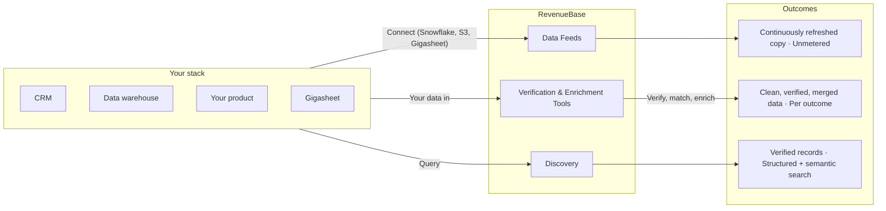

> **Documentation index**  
> Fetch the complete documentation index at: [https://docs.revenuebase.ai/llms.txt](https://docs.revenuebase.ai/llms.txt)  
> Use this file to discover all available pages before exploring further.

# Welcome to RevenueBase

> B2B contact, company, and enrichment data — continuously verified, delivered unmetered, and designed to be embedded in your stack.

## What RevenueBase is

RevenueBase is B2B data infrastructure. We provide 375M+ contacts and 60M+ companies as continuously refreshed data feeds, a set of verification and enrichment tools that run against your own data, and a semantic + deterministic search layer to discover new records. Core data is flat-rate and unmetered. Tools are priced per outcome — you pay when we deliver a result, not when you make a request.

These docs cover everything you need to integrate: API authentication, data feed setup, tool usage, schema references, and the Gigasheet UI for teams that want to work with the data directly without writing code.

## How it's structured

RevenueBase has three layers. Each works independently, but they share the same underlying dataset and verification infrastructure.

<CardGroup cols={3}>
  <Card title="Data Feeds" icon="database">
    375M+ contacts, 60M+ companies, firmographics, and enrichment signals. Delivered via Snowflake, S3, or Gigasheet. Continuously refreshed. Every record includes source provenance and verification timestamp.
  </Card>
  <Card title="Verification & Enrichment Tools" icon="wrench">
    Email verification, company name resolution, job change detection, and contextual enrichment. Operate on your first-party data — clean it, match it against RevenueBase, and merge the result. Per-outcome pricing.
  </Card>
  <Card title="Discovery" icon="magnifying-glass">
    Find new contacts and companies using deterministic filters (headcount, industry, location) and semantic search ("the person who owns demand gen at Series B fintechs") in a single query. Results return enriched and verified by default.
  </Card>
</CardGroup>

## The mental model

Most B2B data products give you a search box and a credit balance. RevenueBase works differently, and understanding the architecture will save you time.

**Core data is a feed, not a lookup.** You don't query RevenueBase for one record at a time. You connect to a continuously updating dataset — via Snowflake shares, S3 delivery, or the Gigasheet UI — and your copy stays current as records are verified, updated, and added. This is the foundation everything else builds on. Access is unmetered: no per-record fees, no throttling based on volume.

**Tools operate on your data, not just ours.** Email verification, company matching, and enrichment aren't limited to RevenueBase records. Upload your CRM export, your third-party lists, or your product's internal contact database. The tools clean and verify whatever you send — then you can merge the result with RevenueBase feeds for a complete, deduplicated dataset. Tools are priced per successful outcome: if a verification returns no result, you're not charged.

**Discovery combines structured and semantic search.** Deterministic filters work on indexed fields — headcount, funding stage, SIC code, job title, geography. Semantic search interprets meaning: "luxury hotels," "ambulatory care facilities," or "the person responsible for data infrastructure" aren't fields in a database, but they resolve to specific records. A single query can combine both: `"ambulatory care facilities in Texas with 200+ employees"` blends semantic understanding with deterministic filters. Discovery results inherit the same verification metadata as feed records because they flow through the same infrastructure.

## How it all fits together

The diagram below shows the three ways you interact with RevenueBase: connect to **data feeds** for a continuous, unmetered copy; send **your data** to verification and enrichment **tools** for per-outcome cleaning and matching; or use **discovery** to find new contacts and companies with structured and semantic search. All three share the same underlying dataset and verification infrastructure.

<Note>
  **Data Feeds** deliver 375M+ contacts and 60M+ companies with source provenance and verification metadata. **Tools** operate on your first-party data and are priced per successful result. **Discovery** combines deterministic filters and semantic search; results are verified by default.
</Note>

## Where to start

Your path depends on how you want to access the data.

<Steps>
  <Step title="If you're integrating programmatically">
    Start with the [API Quickstart](/getting-started/quickstart-api). You'll get an API key, make your first email verification call, and see the response schema. Most teams go from key to production in a single sprint. The API covers real-time email verification, company matching, and discovery — see the full [API Reference](/api-reference/overview) for endpoints, authentication, rate limits, and response formats.
  </Step>
  <Step title="If you're connecting data feeds">
    Start with the [Data Feeds Quickstart](/getting-started/quickstart-data-feeds). You'll configure delivery via Snowflake or S3, understand the table schema (contacts, companies, insights, and pre-joined views), and learn how joins work across tables. Feed data updates continuously — you set up the connection once and your copy stays current.
  </Step>
  <Step title="If you want to work in a UI">
    Start with the [Gigasheet Quickstart](/getting-started/quickstart-gigasheet). Gigasheet gives you spreadsheet-style access to RevenueBase data — search, filter, enrich, and export without writing SQL or code. It's the fastest way to explore the dataset, build segments, and verify data quality before committing to a programmatic integration. If you're in RevOps or running a proof-of-concept, start here.
  </Step>
</Steps>

## What ships with every record

Every record in RevenueBase — whether it comes from a feed, an API call, or a discovery query — includes verification metadata. This isn't a premium add-on. It's the default.

<Accordion title="Verification fields">
  - **Source provenance** — Where the record originated (LinkedIn profile, company website, public filing, etc.)
  - **Verification timestamp** — When the record was last checked, in UTC
  - **Verification summary** — A human-readable and machine-parseable summary of verification status across contact fields

  See [Verification Summaries](/data-feeds/verification-summaries) for schema details and how to use these fields in filters and scoring logic.
</Accordion>

This matters for two reasons. If you're building a product on top of RevenueBase, your users and your compliance team can audit any record end-to-end. If you're feeding data to AI agents or automation pipelines, the verification timestamp and verification summary give your system a programmatic way to decide whether to act on a record or flag it for review.

## Two ways people use RevenueBase

**Embed it in your product.** If you're building a GTM tool, sales platform, or AI agent, RevenueBase is the data layer underneath it. Unmetered core data means per-record pricing doesn't eat your margins. REST APIs return structured JSON. Companies like ZoomInfo, Clay, and Orbital run RevenueBase in production — every email they verify, every contact they surface, flows through this infrastructure.

**Run your own revenue operations on it.** Connect RevenueBase to your CRM or data warehouse. Continuously verify and enrich your existing records instead of running quarterly "refresh" projects. Use Gigasheet to explore, segment, and export without engineering support. Company matching resolves messy duplicates automatically. Email verification runs in real time or in batch.

<Tip>
  Both use cases run on the same API, the same data feeds, and the same tools. The difference is just how you connect and what you do with the output.
</Tip>

## Key references

<CardGroup cols={2}>
  <Card title="API Reference" icon="square-terminal" href="/api-reference/overview">
    Authentication, endpoints, request/response schemas, rate limits, and error codes.
  </Card>
  <Card title="Data Feed Schema" icon="database" href="/data-feeds/overview">
    Table definitions, field types, join relationships, and delivery configuration for Snowflake and S3.
  </Card>
  <Card title="Email Verification" icon="envelope" href="/api-reference/email-verification-overview">
    Real-time and batch verification endpoints, result codes, accuracy methodology, and deliverability scoring.
  </Card>
  <Card title="Company Match" icon="building" href="/api-reference/company-match-overview">
    Resolve messy company names to canonical IDs, discover companies by criteria, and match against RevenueBase's company graph.
  </Card>
  <Card title="Gigasheet" icon="table" href="/gigasheet/overview">
    UI-based access: searching, filtering, enrichment, adding team members, and exporting data.
  </Card>
  <Card title="Joining Tables" icon="link" href="/data-feeds/joining-overview">
    How contacts, companies, insights, and pre-joined views relate and how to join them correctly.
  </Card>
</CardGroup>
